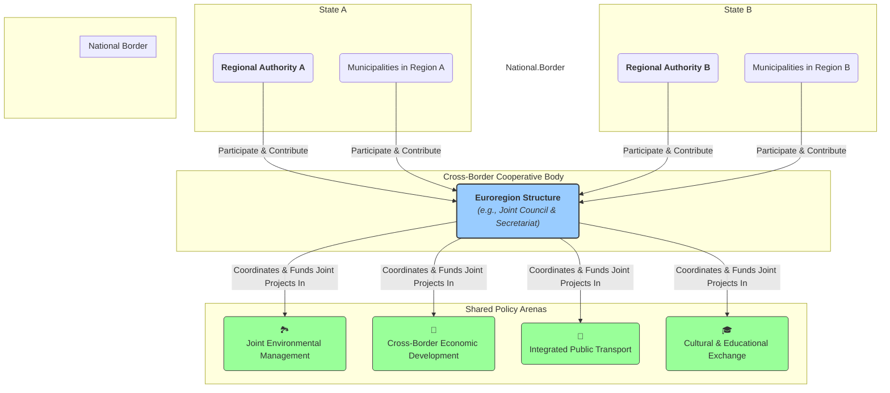

```mermaid
graph TD
    subgraph "State A"
        RA("<b>Regional Authority A</b>")
        MuniA("Municipalities in Region A")
    end

    subgraph "State B"
        RB("<b>Regional Authority B</b>")
        MuniB("Municipalities in Region B")
    end

    subgraph " "
      direction LR
      Border1( );
      Border2( );
      Border1 ~~~ Border2;
      subgraph "National Border"
      end
      style National.Border fill:none,stroke:none
    end
    style Border1 fill:none,stroke:none
    style Border2 fill:none,stroke:none
    
    subgraph "Cross-Border Cooperative Body"
        Euroregion("<b>Euroregion Structure</b><br><i>(e.g., Joint Council & Secretariat)</i>")
    end

    subgraph "Shared Policy Arenas"
        P1("🏞️<br>Joint Environmental Management")
        P2("💼<br>Cross-Border Economic Development")
        P3("🚌<br>Integrated Public Transport")
        P4("🎓<br>Cultural & Educational Exchange")
    end

    RA & MuniA -- "Participate & Contribute" --> Euroregion
    RB & MuniB -- "Participate & Contribute" --> Euroregion
    
    Euroregion -- "Coordinates & Funds Joint Projects In" --> P1 & P2 & P3 & P4

    style Euroregion fill:#9cf,stroke:#333,stroke-width:2px
    style P1 fill:#9f9,stroke:#333
    style P2 fill:#9f9,stroke:#333
    style P3 fill:#9f9,stroke:#333
    style P4 fill:#9f9,stroke:#333
```
