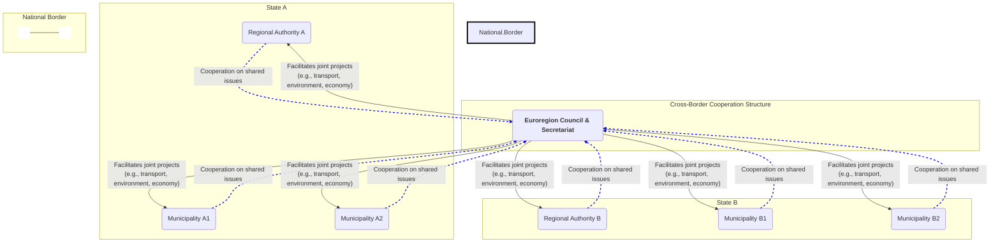

```mermaid
graph TD
    subgraph "State A"
        direction TB
        RA("Regional Authority A")
        MuniA1("Municipality A1")
        MuniA2("Municipality A2")
    end

    subgraph "State B"
        direction TB
        RB("Regional Authority B")
        MuniB1("Municipality B1")
        MuniB2("Municipality B2")
    end
    
    subgraph "Cross-Border Cooperation Structure"
        Euroregion("<b>Euroregion Council & Secretariat</b>")
    end

    RA & MuniA1 & MuniA2 -- "Cooperation on shared issues" --> Euroregion
    RB & MuniB1 & MuniB2 -- "Cooperation on shared issues" --> Euroregion
    
    Euroregion -- "Facilitates joint projects<br>(e.g., transport, environment, economy)" --> RA & RB & MuniA1 & MuniA2 & MuniB1 & MuniB2

    linkStyle 0,1,2,3,4,5 stroke-width:2px,stroke:blue,stroke-dasharray: 5 5;

    %% This is a hack to draw the border line
    subgraph "National Border"
      direction LR
      Border1( );
      Border2( );
      Border1---Border2;
    end
    style Border1 fill:#fff,stroke:#fff
    style Border2 fill:#fff,stroke:#fff
    style National.Border stroke-width:3px,stroke:black
```
